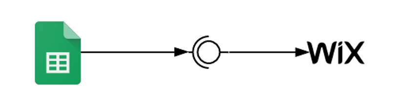
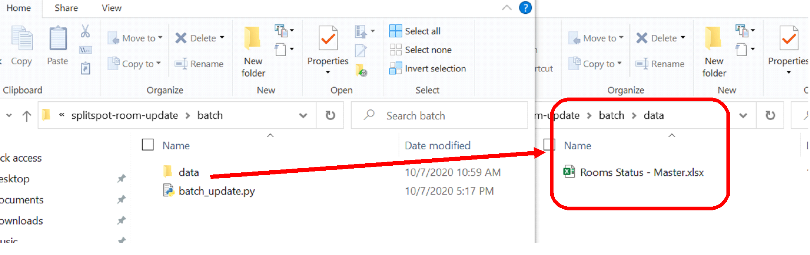

# SplitSpot: Room Update Code
The following document aims to explain how the development to update rooms information on Wix from the Room Master 
Google Spreadsheet has been created. 

## Table of Contents
1. [Objective](#objective)
1. [Automatic update from Rooms Master Google Spreadsheet](#automatic-update-from-rooms-master-google-spreadsheet)
    1. [Architecture](#architecture)
    1. [Wix (Corvid)](#wix-corvid)
    1. [Google Spreadsheet (App Script)](#google-spreadsheet-app-script)
1. [Batch Update](#batch-update)
    1. [Prerequisites](#prerequisites)
    1. [Execution Process](#execution-process)
    1. [Troubleshooting](#troubleshooting)
1. [Recommendations](#recommendation)

## Objective
The development made has two objective:
1. Enable automatic update from the Google Spreadsheet to the Wix site the the price and the availability has changed
1. Allow the automatic batch update from a downloaded excel version of Google Spreadsheet to the Wix site. This batch 
update also focuses on changes in price and in availability status.

The excel file has one row per room in a unit, while the Wix site has an internal database where each row is one unit 
(A unit is a house, apartment that holds many rooms).

For the first objective, any change made on the price, on the status, or on the availability date, the Wix data needs 
to be update accordingly. A change in price in a room will trigger a change in price in that room but also a change in 
price in the whole unit. The new price of the unit will the lowest price of all the available rooms. If no rooms are 
available, the unit will have be updated with an empty price. A change in status in a room on the Spreadsheet 
will trigger a update of the status of a room in Wix as well as an update on the status of a unit. A units is 
considered to be available if it has one of the following status:
```json
{
    "Upcoming Vacancy": true,
    "Vacant": true,
    "Roommate Introduction": true,
    "Lease Sent": true,
    "On-boarding": true
}
```
A units is considered to be unavailable if it has one of the following status:
```json
{
    "Occupied": false,
    "Lease Signed": false,
    "Deposits Complete": false,
    "Off-boarding": false
}
```
Additionally, if a room status is on "Upcoming Vacancy", the program will need to check the Date field of that room to 
identify from when it will be available. This way, the availability text of the room will read "Available [month] 1st".
For the unit, if there is at least one room available, the whole unit is available. If, from all the rooms available,
there is at least one that has a status different from *"Upcoming Vacancy"*, the whole unit will be available now. If 
all the available rooms in a unit have an *"Upcoming Vacancy"* status, the whole unit will be available on the closest 
month among all the rooms. For instance if there are two rooms with upcoming vacancies in the same unit, one in 
December 2020 and another one in January 2021, the whole unit availability text will read "Available December 1st" 
(assuming the current month is October 2020).

For the second objective, the batch program will also follow the behavior described before, but it will work with 
static data. This means that, instead of a change being triggered by a change on a field, the program will be executed 
on demand, and it will read the data from a downloaded excel version of the Room Master Google Spreadsheet.

## Automatic update from Rooms Master Google Spreadsheet
### Architecture
The architecture of this program is simple. The Google Spreadsheet has a code that is launched everytime a cell is 
edited. If the right conditions are met, the code call a RESTful web service exposed by Wix.


*Note: The direction of the arrows shows who starts the interaction*

### Wix (Corvid)
Wix uses Corvid, which is a javascript-based engine, to power its backend. Corvid allows to create and publish to the 
internet RESTful Web Services. Wix calls this *http function*

- [What are http functions in Wix](https://support.wix.com/en/article/corvid-exposing-a-site-api-with-http-functions)
- [Documentation](https://www.wix.com/corvid/reference/wix-http-functions)

4 functions have been created:
1. test (Get Method): This method has only be designed to test the services are running.
1. test (Post Method): This method has only be designed to test the services are running and that the parameters sent 
over the HTTP POST method are being received as expected. 
1. updateRoom (Post Method): This method is the one used by the Google Spreadsheet App Script. It has 4 different 
ways to structure the request:
    - To update unit price
    ```json
    {
        "unitId":"00000000-0000-0000-0000-000000000000",
        "field":"unitPrice",
        "value":800
    }
   ```
    - To update unit availability
    ```json
       {
        "unitId":"00000000-0000-0000-0000-000000000000",
        "field":"unitAvailable",
        "value":[true, "Available Now!", "5/5 Rooms Available"]
    }
   ```
    - To update room price
    ```json
    {
        "unitId":"00000000-0000-0000-0000-000000000000",
        "field":"roomPrice",
        "value":["B", 1000]
    }
   ```
    - To update room availability
    ```json
    {
        "unitId":"00000000-0000-0000-0000-000000000000",
        "field":"roomAvailable",
        "value":["A", true]
    }
   ```
1. batchUpdate (Post Method): This method is used by the batch process, and it performs the 4 types of update that the 
updateRoom method does in only one request. It expects the request using the following structure.
```json
    {
        "unitId":"00000000-0000-0000-0000-000000000000",
        "unitPrice":750,
        "unitAvailability":[true, "Available Now!", "5/5 Rooms Available"],
        "rooms":["A", "B", "C", "D"],
        "roomsPrice":[800, 1000, null, null],
        "roomsAvailability":["Available Now!", "Available November 1st", "Not Available", "Not Available"]
    }
```
#### Invoking Wix http functions
##### Unpublished site
Once the methods are created in the *http-functions.js* file in the Wix backend but not yet published, they will be 
available for it use using the following URL format:
```text
    https://splitspot.com/_functions-dev/[method_name]
```
For example, to access the test GET method without being published, use the following URL
```text
    https://splitspot.com/_functions-dev/test
```
Any changes made to the data using this URL will only affect the Sandbox collection structure of the modified dataset.

##### Published site
After the Wix site has been published, you can invoke the http methods using the following URL format:
```text
    https://splitspot.com/_functions/[method_name]
```
For example, to access the test GET method after the site has been published, use the following URL
```text
    https://splitspot.com/_functions/test
```
Any changes made to the data using this URL will only affect the Live collection structure of the modified dataset.

[About Live and Sandbox Collection](https://support.wix.com/en/article/about-sandbox-and-live-collections-and-syncing#live-collections)

### Google Spreadsheet (App Script)
Google Spreadsheets, as well as the apps that are part of the Google Suite, uses App Script to create automations.
App Script is a javascript based language where any automation can be attached to any event on a file from the Google 
Suite. For this case, the script created is attached to the onEdit trigger. This means that, what ever change the user 
does, the script will be launched. Nonetheless, the code will only make the updates required when the changes are made 
in:
- The sheet "List" and in the columns "Status" or "Date" 
- The sheet "Pricing Updates" and in the column "Current Price"

Given that this automation will use a RESTful service from Wix (the updateRoom POST method), it needs to be attached to 
the onEdit event as an [installable triggers](https://developers.google.com/apps-script/guides/triggers/installable)

## Batch Update
This development consists on a single program developed using Python that uses the data from a download excel version 
of the Room Master Google Spreadsheet and performs the room update using the batchUpdate Wix http function.

### How to execute the batch update
### Prerequisites
1. Make you have Python 3.7 installed in the computer you will execute the batch file.
1. You will need the following Python packages
    1. pandas (version 1.1.1)
    1. requests (version 2.24.0)
    1. time (comes with Python)
    1. datetime (comes with Python)
1. You will need the script [batch_update.py](batch/batch_update.py) and save in a local directory
1. Validate the following on the Google Spreadsheet:
    1. Make sure that the data to update is in a sheet called "List"
    1. The process will read the data from the following columns, so be certain that they exist and are updated:
        1. Wix ID
        1. Room
        1. Price
        1. Status
        1. Date
1. Download the Google Spreadsheet as "Rooms Status - Master.xlsx".
1. Locate the script to execute, create a folder called "data", and move the downloaded file there.


### Execution Process
1. Open a terminal
1. Locate yourself in the directory where you saved the **batch_update.py** script
1. Execute the following command
```commandline
python batch_update.py
```

### Troubleshooting
The program will show the log of execution log.

#### Problem 1: Some rows were not updated
If there is a problem with certain rooms:
1. Remove from the spreadsheet those units whose rooms have been updated completely. **IMPORTANT: If there is at least 
one room that hasn't been updated, DO NOT REMOVE ANY OF THE ROOMS FROM THAT UNIT.** Save the new spreadsheet following 
the criteria described in steps 4 and 6 of the [prerequisites](#prerequisites)
2. Follow de [execution process](#execution-process) again

#### Problem 2: No rows updated
If no row was update:
1. To be sure that the services are working, follow this link and expect a "Success!!!" text:
 [Test Service](http://splitspot.com/_functions/test).
1. If it is not working, there is a problem with wix

#### Problem 3: Wix ID
The program only works with rows that have a Wix ID. Make sure that the rows you want to update have this ID and that 
is valid (check and delete for spaces at the beginning or at the end).

#### Problem 4: New or Modified Status
Make sure you didn't included new status or changed the name of any of them. The program is expecting the following:
```json
{
    "Upcoming Vacancy": true,
    "Vacant": true,
    "Roommate Introduction": true,
    "Lease Sent": true,
    "On-boarding": true,

    "Occupied": false,
    "Lease Signed": false,
    "Deposits Complete": false,
    "Off-boarding": false
}
```

#### Problem 5: Excel not found
Make sure that the file "Rooms Status - Master.xlsx" exist as specified in the prerequisites and it has the exact same 
name.

## Recommendations
### Create a database for the rooms
Google Spreadsheet is not the best way to store critical business information when a company starts to grow.
You face the following risks/problems:
    1. Reduced ability to audit who makes what changes and when it is done
    1. Lack of security. If shared with someone, he/she can freely access the data and modify it. 
    If the integration with the site is active, he/she will be able to update the information in the public site.
    1. Maintainability of the data can get complex as the business starts to grow.
    1. Reduced scalability.
    1. Consistency problems
If a centralized database is created, the batch process and the automatic update will require to look at this data 
instead of looking at the Google Spreadsheet. 

### Add security to Wix http function 
If someone has access to the service URL to update the rooms (either individually or on batches), 
it will be able to do it. Of course, the person will need to know the structure of the request, but if he/she 
figures it out, it won't have any restrictions.

You can do this in two ways:
1. If there is no database for the rooms, create a dataset in Wix with a list of authorized users to make modification 
to Wix data. Then, modify the Wix http functions so it ask for a user/password in addition to the needed parameters 
and, before making any update authenticate and authorize that user.
1. If there is a database, create a Wix task that connects to the database through a secure web service exposed by an 
application that has access to that data. This is much more secure and scalable

### (Optional) Modify the batch process so it connects directly to Google Spreadsheet
By doing this, the process won't depend on the manual task of someone downloading the data to were the process is 
running. Instead, it will be able to connect directly to Google Spreadsheet to perform the required update.

### Schedule the execution of the batch process
Create an scheduled task that will execute the batch process automatically. This will work better if the latter 
recommendation is built. If not, someone will need to download the data where the script is before it is executed.